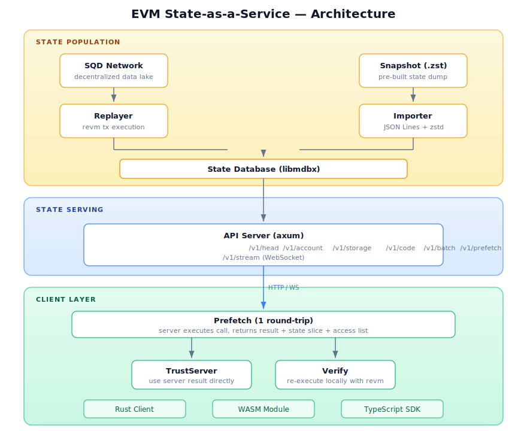
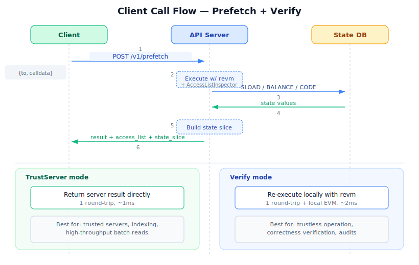

# EVM State-as-a-Service

A decoupled EVM state serving architecture that separates blockchain state storage from smart contract execution. Instead of routing every `eth_call` through an RPC node, this system maintains a read-optimized flat state database and lets clients execute view functions locally using [revm](https://github.com/bluealloy/revm).

State is populated by replaying blocks from the [Subsquid Network](https://docs.sqd.dev/) (a decentralized data lake) or by importing pre-built snapshots. Clients fetch only the state slices they need, optionally re-execute locally for trustless verification.

## Architecture

<p align="center">
  
</p>

## How It Works

**State population** follows one of two paths:

1. **Replay** — The SQD fetcher streams blocks from the Subsquid Network. The replayer executes every transaction with revm and commits the resulting state changes to the database, block by block.
2. **Snapshot import** — A pre-built state dump (JSON Lines, optionally zstd-compressed) is loaded directly into the database, then incremental replay continues from the snapshot's head block.

**Serving a client call** (e.g. `balanceOf`):

<p align="center">
  
</p>

1. Client sends `POST /v1/prefetch` with `{to, calldata}`.
2. Server executes the call with revm using an inspector that records every `SLOAD`, `BALANCE`, and `EXTCODE*` access.
3. Server returns `{result, access_list, state_slice}` — the call result plus all accessed state values.
4. In **TrustServer** mode, the client uses the result directly (1 round-trip).
5. In **Verify** mode, the client re-executes locally with revm using the pre-loaded state slice and confirms the result matches.

## Quick Start

```sh
# Build everything
cargo build --release

# Import a state snapshot
evm-state --db ./polygon.mdbx import snapshot.jsonl.zst

# Or replay from the SQD Network (Polygon by default)
evm-state --db ./polygon.mdbx replay --from 65000000

# Start the API server
evm-state --db ./polygon.mdbx serve --listen 0.0.0.0:3000

# Validate state against an archive RPC
evm-state --db ./polygon.mdbx validate --rpc-url https://polygon-rpc.com --count 100
```

## Configuration

All settings can be provided via CLI flags, environment variables, or a TOML config file. Priority: CLI > env var > config file > default.

| Flag | Env Var | Default | Description |
|------|---------|---------|-------------|
| `--db` | `EVM_STATE_DB` | `./state.mdbx` | Database path |
| `--chain-id` | `EVM_STATE_CHAIN_ID` | `137` | Chain ID (1 = Ethereum, 137 = Polygon) |
| `--config` | — | — | TOML config file path |
| `--log-level` | `EVM_STATE_LOG` | `info` | Log level |

Example `config.toml`:
```toml
db_path = "./polygon.mdbx"
chain_id = 137
listen = "0.0.0.0:3000"
portal = "https://portal.sqd.dev"
rpc_url = "https://polygon-rpc.com"  # only needed for `validate` subcommand
```

All fields are optional. `rpc_url` is only used by `evm-state validate` to spot-check local state against an archive RPC node.

## Client Usage

### Rust

```rust
use evm_state_client::{StateClient, TrustMode};

let client = StateClient::new("http://localhost:3000", spec_id, TrustMode::Verify);
let result = client.call(contract, &calldata, Some(from), None)?;
```

### TypeScript (viem drop-in)

```typescript
import { EvmStateClient } from '@sqd/evm-state';
import { createPublicClient } from 'viem';

const sqd = new EvmStateClient({ endpoint: 'http://localhost:3000' });
const client = createPublicClient({ transport: sqd.asViemTransport() });

// Use viem exactly as you normally would
const balance = await client.readContract({
  address: '0x...token',
  abi: erc20Abi,
  functionName: 'balanceOf',
  args: ['0x...owner'],
});
```

### TypeScript (ABI-aware)

```typescript
const erc20 = sqd.contract('0x...token', erc20Abi);
const balance = await erc20.read.balanceOf(['0x...owner']);
```

## Project Structure

```
crates/
  common/          Shared EVM types (AccountInfo, key encoding)
  data-types/      Block & transaction types (SQD Network format)
  chain-spec/      Hardfork schedules (Ethereum, Polygon)
  state-db/        Flat KV database (libmdbx) + revm Database trait
  replayer/        Single-block & pipeline execution with revm
  sqd-fetcher/     Async block streaming from Subsquid Network
  snapshot/        JSON Lines importer with zstd + resume support
  api/             HTTP + WebSocket server (axum)
  client/          Rust client (RemoteDB, LRU cache, TrustServer/Verify)
  client-wasm/     WASM-compiled client with JS bindings
  validation/      State validator (random sampling, binary search)
  bench/           Benchmarks (criterion)
  cli/             Unified CLI binary (serve, replay, import, validate)

packages/
  evm-state/       TypeScript SDK (@sqd/evm-state) wrapping WASM client
  demo/            TypeScript Uniswap V3 demo
```

## API Endpoints

| Method | Path | Description |
|--------|------|-------------|
| GET | `/v1/head` | Current head block number |
| GET | `/v1/account/{addr}` | Account nonce, balance, code hash |
| GET | `/v1/storage/{addr}/{slot}` | Storage slot value |
| GET | `/v1/code/{addr}` | Contract bytecode |
| POST | `/v1/batch` | Multiple queries in one request |
| POST | `/v1/prefetch` | Execute call + return state slice |
| WS | `/v1/stream` | Interactive WebSocket queries |

## Benchmarks

The `bench` crate includes a Criterion-based benchmarking suite that measures state service performance and optionally compares against a traditional JSON-RPC endpoint.

### Scenarios

| Scenario | Description |
|----------|-------------|
| **Single call** | One `eth_call` via the prefetch endpoint (TrustServer and Verify modes) |
| **100 parallel reads** | 100 sequential storage/account reads via RemoteDB |
| **200-tick Uniswap scan** | Single prefetch reading 200 storage slots vs. 200 individual RPC calls |

### Running

```sh
# Criterion benchmarks (HTML reports in target/criterion/)
cargo bench -p evm-state-bench

# Markdown report with p50/p95/p99 percentiles
cargo run --release -p evm-state-bench --bin report

# Compare against an external RPC
RPC_URL=https://polygon-rpc.com cargo run --release -p evm-state-bench --bin report
```

The report outputs a markdown table with latency percentiles and speedup factors:

```
| Scenario       | Service p50 | Service p95 | Service p99 | RPC p50  | RPC p99  | Speedup |
|----------------|-------------|-------------|-------------|----------|----------|---------|
| Single call    | 1.2ms       | 2.5ms       | 3.7ms       | 45.6ms   | 67.8ms   | 37.1x   |
| 100 reads      | 12.3ms      | 25.6ms      | 38.9ms      | —        | —        | —       |
| 200-tick scan  | 5.6ms       | 11.2ms      | 18.9ms      | 234.5ms  | 456.7ms  | 41.9x   |
```

## Supported Networks

| Network | Chain ID | Status |
|---------|----------|--------|
| Polygon PoS | 137 | PoC target |
| Ethereum | 1 | Chain spec ready |

## Further Reading

- **[CONCEPT.md](CONCEPT.md)** — Full RFC: problem statement, architecture, competitive analysis, roadmap
- **[PLAN.md](PLAN.md)** — 24-step implementation plan with dependency graph
- Each crate has its own `README.md` with detailed usage and API documentation
