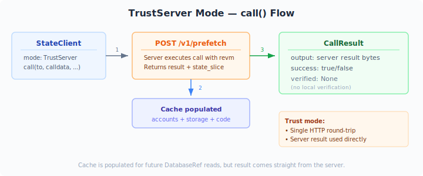
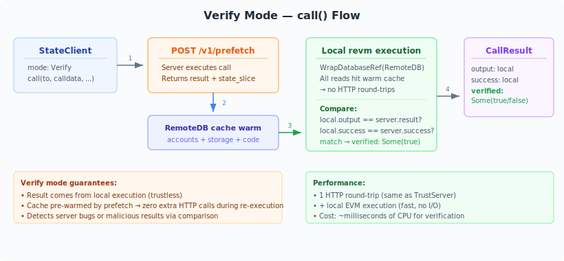

# evm-state-client

Rust client library for the EVM state API. Implements revm's `DatabaseRef` trait backed by HTTP requests, allowing remote state reads to be used transparently with revm.

## Features

- **`RemoteDB`** — a `DatabaseRef` implementation that fetches accounts, storage, and code from the state API server
- **LRU caching** — repeated reads for the same key are served from a local cache (default capacity: 10,000 entries per tier)
- **Prefetch** — call `prefetch()` to speculatively execute a call on the server and preload all accessed state into the cache in one round-trip
- **Proactive code fetch** — when `basic_ref` encounters a contract account, it automatically fetches and caches the bytecode
- **`StateClient`** — higher-level wrapper that combines prefetch with optional local revm re-execution for trustless verification

## Low-level usage: RemoteDB

```rust
use evm_state_client::RemoteDB;
use revm::database_interface::DatabaseRef;

let db = RemoteDB::new("http://localhost:3000");

// Single reads — fetched on demand, then cached
let account = db.basic_ref(address)?;
let value = db.storage_ref(address, slot)?;
let code = db.code_by_hash_ref(code_hash)?;

// Prefetch — one round-trip preloads everything needed for a call
let result = db.prefetch(to, &calldata, Some(from), None)?;
// Now all accessed state is cached — local EVM execution needs no more HTTP calls
```

## High-level usage: StateClient

`StateClient` wraps `RemoteDB` with a chain spec and trust mode, providing a simple `call()` API.

### TrustServer mode



Returns the server's execution result directly. Single HTTP round-trip, no local re-execution.

```rust
use evm_state_client::{StateClient, TrustMode};
use revm::primitives::hardfork::SpecId;

let client = StateClient::new("http://localhost:3000", SpecId::SHANGHAI, TrustMode::TrustServer);
let result = client.call(contract, &calldata, Some(from), None)?;
assert!(result.success);
// result.verified is None — server result used directly
```

### Verify mode



Re-executes the call locally with revm using state pre-warmed by the prefetch. Compares local and server results.

```rust
use evm_state_client::{StateClient, TrustMode};
use revm::primitives::hardfork::SpecId;

let client = StateClient::new("http://localhost:3000", SpecId::SHANGHAI, TrustMode::Verify);
let result = client.call(contract, &calldata, Some(from), None)?;
assert!(result.success);
assert_eq!(result.verified, Some(true)); // local matches server
```

Verify mode is useful for:
- **Trustless operation** — result comes from local execution, not the server
- **Detecting server bugs** — if local and server results diverge, `verified` is `Some(false)`
- **Zero extra cost** — the prefetch response pre-warms the cache, so local re-execution requires no additional HTTP calls

## How it works

`RemoteDB` wraps `ureq` (a blocking HTTP client) and three LRU caches (accounts, storage, code). Each `DatabaseRef` method checks the cache first; on a miss it makes a GET request to the API server and caches the result.

The `prefetch()` method calls `POST /v1/prefetch`, which speculatively executes the call on the server and returns all accessed state. The client populates its caches from the response, so a subsequent local EVM execution completes without any additional HTTP round-trips.

## Cache behavior

- **Accounts**: Cached by address. Missing accounts are cached as `None` to avoid repeated 404 lookups.
- **Storage**: Cached by `(address, slot)`. Missing slots are cached as `U256::ZERO`.
- **Code**: Cached by code hash. Populated proactively when `basic_ref` finds a contract, or via `prefetch()`.
