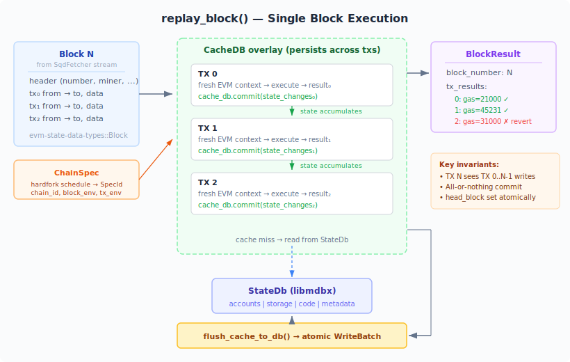
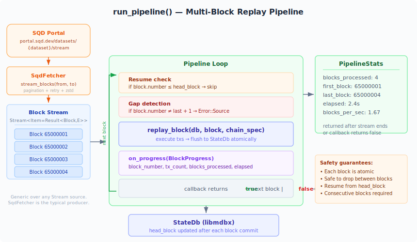

# evm-state-replayer

Replays EVM blocks against a [`StateDb`](../state-db) to reconstruct state. Executes all transactions in order using [revm](https://github.com/bluealloy/revm) and commits the resulting state changes atomically.

## How it works



1. A `CacheDB` overlay wraps the `StateDb` as a read-only backing store.
2. Each transaction gets a fresh EVM context (clean journal), but the `CacheDB` persists across transactions so state changes accumulate within the block.
3. After all transactions execute, the `CacheDB` cache is flushed to `StateDb` in a single atomic `WriteBatch`.

This ensures that:
- Transaction N can see state changes from transactions 0..N-1 (intra-block visibility).
- Either all changes from a block are committed, or none are (atomicity).
- The head block number is updated as part of the same batch.

## Usage

```rust
use evm_state_replayer::replay_block;

let result = replay_block(&db, &block, &chain_spec)?;

for (i, tx) in result.tx_results.iter().enumerate() {
    println!("tx {i}: gas_used={}, success={}", tx.gas_used, tx.success);
}
// State changes are already committed to db at this point.
```

## Pipeline



The `pipeline` module provides `run_pipeline()` for replaying a sequence of blocks from any async `Stream<Item = Result<Block, E>>`. This decouples block sourcing (e.g. from the SQD fetcher) from replay logic.

```rust
use evm_state_replayer::pipeline::run_pipeline;
use futures::stream;

let stats = run_pipeline(&db, &chain_spec, block_stream, |progress| {
    println!("block {} ({} blk/s)",
        progress.block_number, progress.blocks_per_sec());
    true // return false to stop early
}).await?;

println!("{} blocks in {:.1}s", stats.blocks_processed, stats.elapsed.as_secs_f64());
```

Features:
- **Resume** — reads `head_block` from the database and skips already-processed blocks
- **Gap detection** — returns an error if blocks are not consecutive
- **Graceful shutdown** — the `on_progress` callback returns a `bool`; returning `false` stops after the current block
- **Progress tracking** — `BlockProgress` reports block number, tx count, blocks processed, elapsed time, and throughput

## Error handling

- Database errors (RocksDB failures) propagate as `Error::Db`.
- EVM execution errors (invalid header, missing fields) propagate as `Error::Evm` with the failing transaction index.
- Block source errors (stream failures, block gaps) propagate as `Error::Source`.
- Reverted transactions are **not** errors — they produce `TxResult { success: false }` and their gas is consumed, but state changes from the revert are rolled back by revm.
